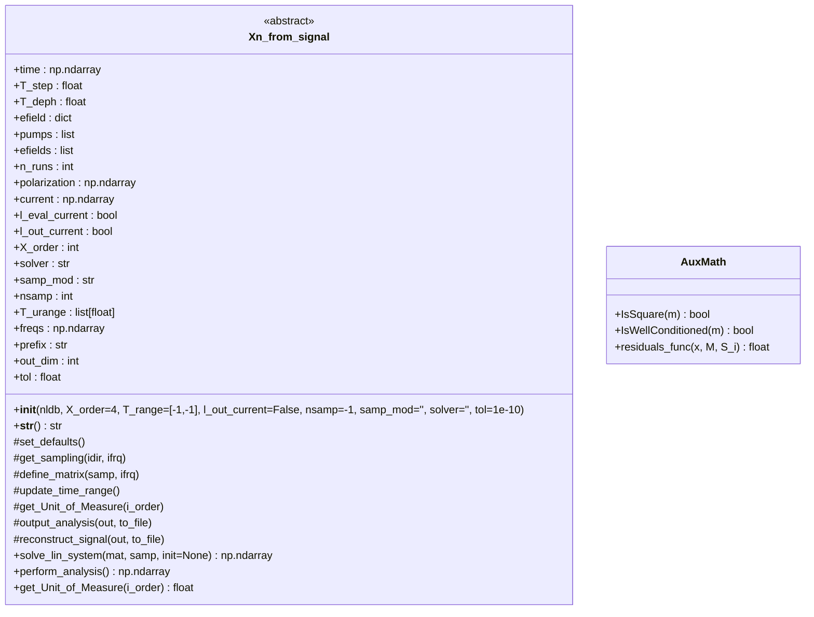
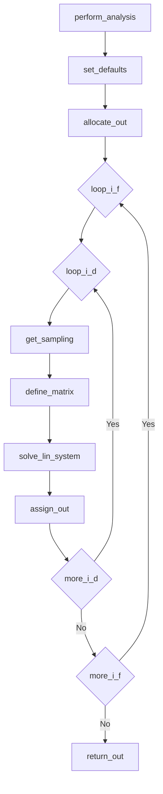
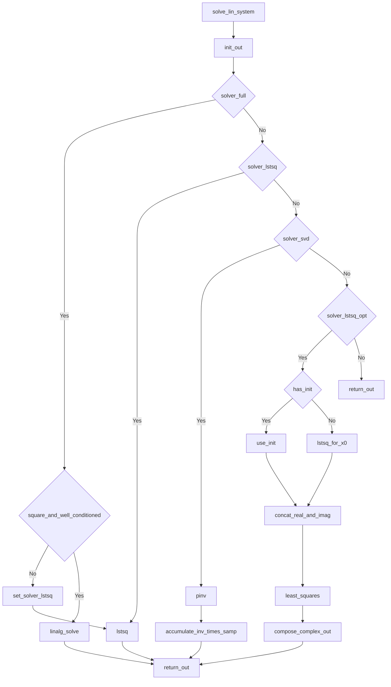
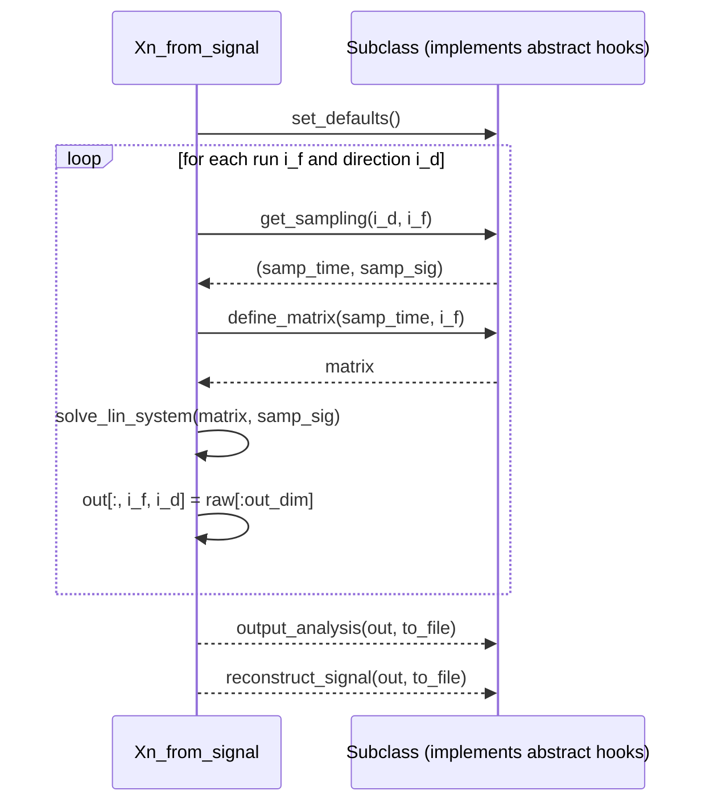

# `Xn_from_signal`: documentation (version 1.0)

#### Myrta Grüning, Claudio Attaccalite, Mike Pointeck, Anna Romani, Mao Yuncheng

This document describes the `Xn_from_signal` abstract python class and a set of derived classes, part of the `YamboPy` code, for extracting nonlinear susceptibilities and conductivities from the macroscopic time-dependent polarization $P$ and current $J$.  An extended theoretical background  can be found in Nonlinear Optics textbooks, see e.g. Sec. 2 of “The Elements of Nonlinear Optics” by Butcher and Cotter and the other sources listed in the [Bibliography](## Bibliography). A [minimal background](## 0. Theory ) is given in the next session to help understanding the code and facilitate further development. The rest of the code is dedicated to describe the code structure, key workflows, main functions and to provide an essential guide of the code use.  

## 0. Theory 

The problem solved is algebraic:

$$ M_{kj} S_j = P_k,$$

where $P_k$ is the time-dependent polarization (or current) sampled on $N_t$ times $\{t_k\}$ which is output by the `yambo`/`lumen`code; the resulting $S_j$ is proportional to the susceptibility (conductivity) of nonlinear order $j$. The matrix of coefficients $M_{kj}$, of dimensions $N_t \times N_\text{nl}$ contains the time dependence to the applied electric field. So far three physical situations are implemented:
1. a single monochromatic electric field: $ {\bf E}_0 \sin(\omega_0 t)$
2. two monochromatic electric fields: $ {\bf E}_0 (\sin(\omega_1 t) + \sin(\omega_2 t)) $
3. a pulse-shaped electric field: $ {\bf E}(t) \sin(\omega_0 t)$. Here, it is assumed that the shape of the pulse ${\bf E}(t)$ varies slowly with respect to the period $2\pi/\omega_0$. So far, only a Gaussian pulse (${\bf E}(t) = {\bf E}_0 \exp(-(t-t_0)^2/(2\sigma^2))/(\sqrt{2}\sigma)$) has been implemented. 

Four solvers are available:

1. the standard solver for full, well-determined matrix:  calls [`numpy.linalg.solve`](https://numpy.org/doc/stable/reference/generated/numpy.linalg.solve.html)
2. the least square solver, when $N_t \gg N_\text{nl}$ : calls  [`numpy.linalg.lstsq`](https://numpy.org/doc/stable/reference/generated/numpy.linalg.lstsq.html#numpy.linalg.lstsq)
3. the single value decomposition, using the Moore-Penrose pseudoinverse,  when $N_t \gg N_\text{nl}$: calls [`numpy.linalg.pinv`](https://numpy.org/doc/stable/reference/generated/numpy.linalg.pinv.html#numpy.linalg.pinv)
4. the least square solver with an initial guess, when $N_t \gg N_\text{nl}$ : calls  [`scipy.optimize.least_squares`](https://docs.scipy.org/doc/scipy/reference/generated/scipy.optimize.least_squares.html)

From $S_j$ the susceptibilities (or conductivities) $\chi^{(n)}(-\omega_\sigma, \omega_1, \dots, \omega_n)$  are obtained using the following expression:

$$ S_j = C_0 K (-\omega_\sigma, \omega_1, \dots, \omega_n)\chi^{(n)}(-\omega_\sigma, \omega_1, \dots, \omega_n) $$

where $K(-\omega_\sigma; \omega_1, \dots, \omega_n)$ is a numerical factor that accounts for the intrinsic permutation symmetry depending on the nonlinear order and frequency arguments of $\chi$. $C_0$ is a further numerical factor depending on the applied electric field.

Details on the implementation can be found in the sources listed in the [Bibliography](## Bibliography)

---

## 1) Class structure (`classDiagram`)

---

## 2) Workflow: `perform_analysis` (`flowchart`)

---

## 3) Workflow: `solve_lin_system` (`flowchart`)

---

## 4) Sequence view (optional)

## Bibliography
