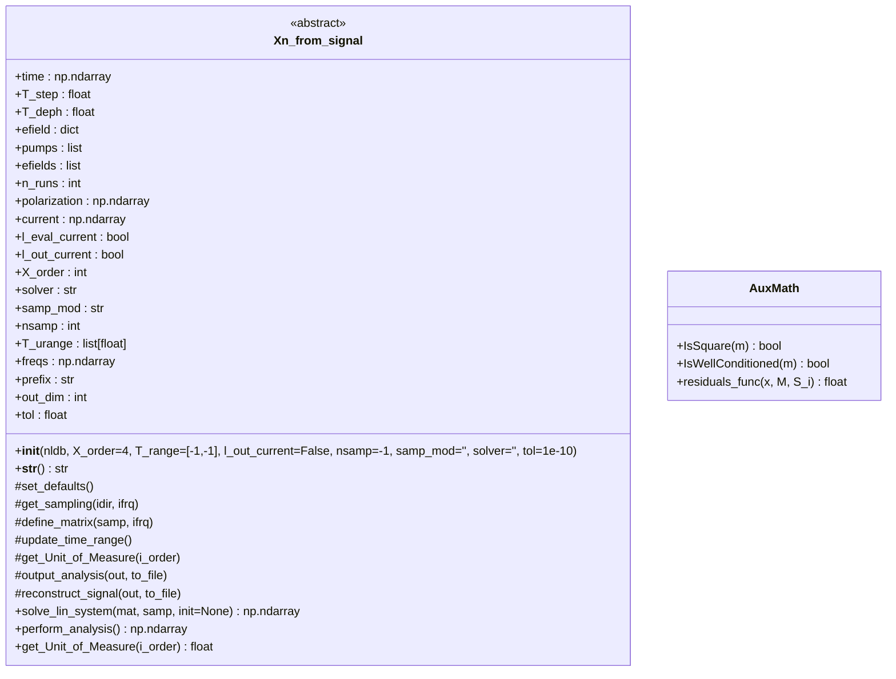
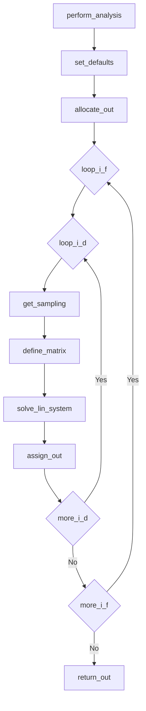
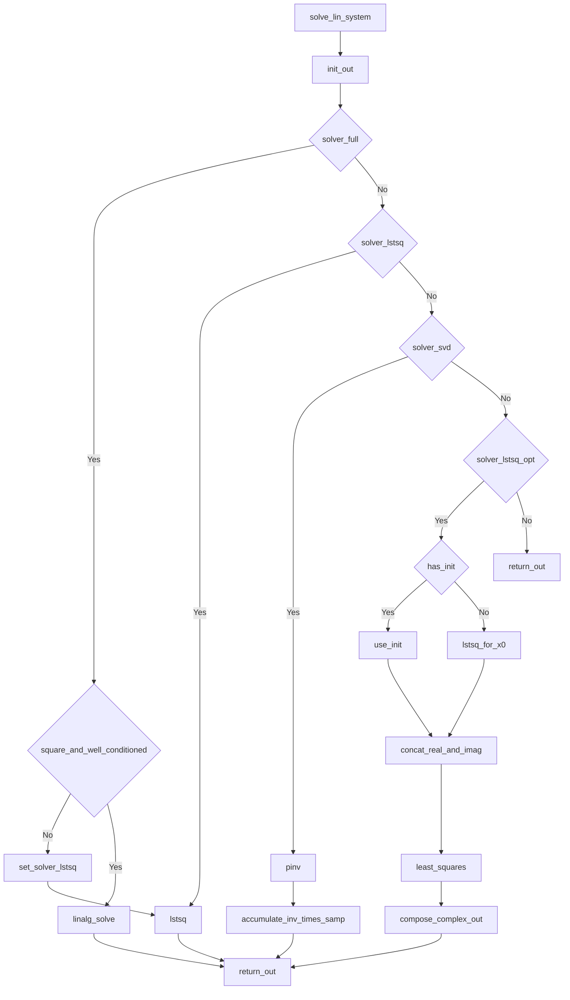
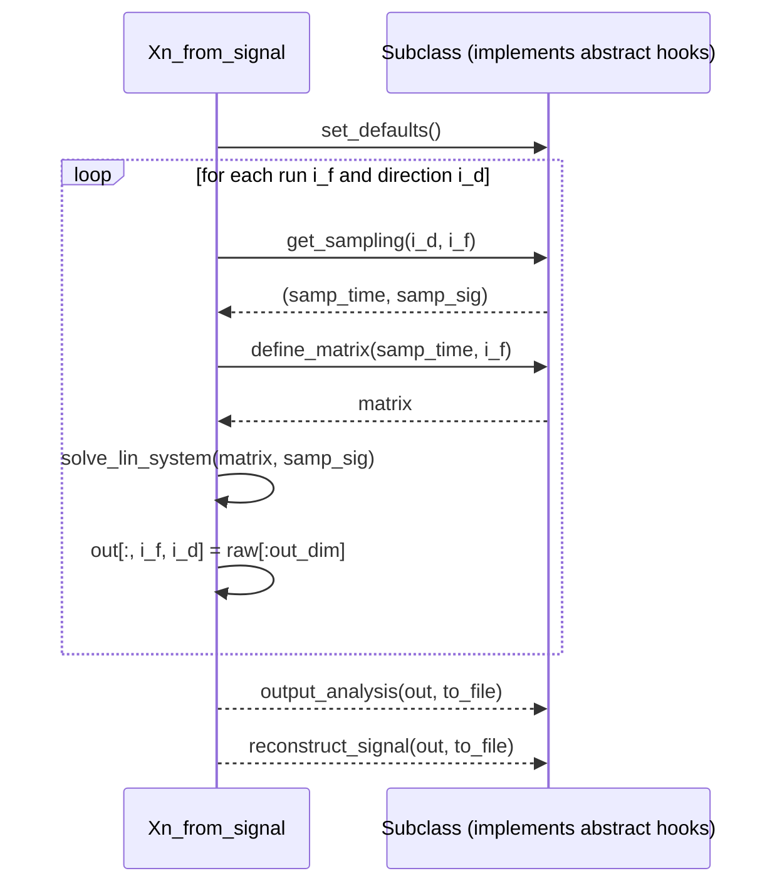

# `Xn_from_signal` – Mermaid Diagrams

This document contains Mermaid diagrams derived from `nl_analysis.py` for the abstract class **`Xn_from_signal`** and its key workflows.

---

## 1) Class structure (`classDiagram`)

---

## 2) Workflow: `perform_analysis` (`flowchart`)

---

## 3) Workflow: `solve_lin_system` (`flowchart`)

---

## 4) Sequence view (optional)

