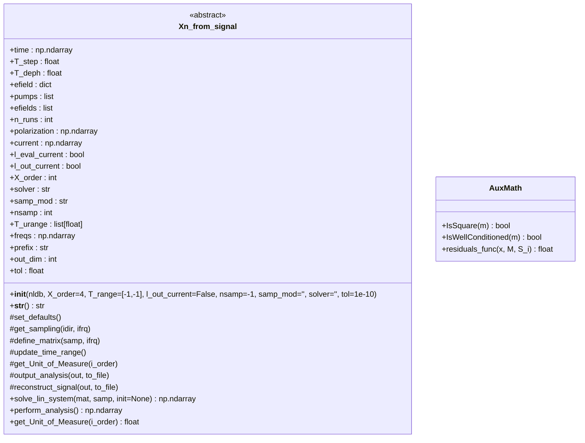
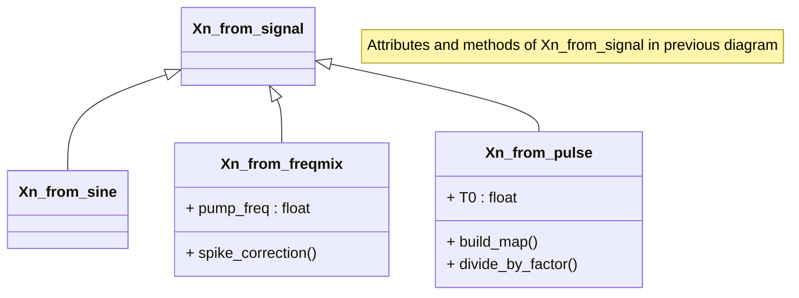
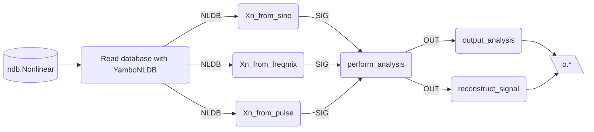

# `Xn_from_signal`: documentation (version 1.0)

#### Myrta Grüning, Claudio Attaccalite, Mike Pointeck, Anna Romani, Mao Yuncheng

This document describes the `Xn_from_signal` abstract python class and a set of derived classes, part of the `YamboPy` code, for extracting nonlinear susceptibilities and conductivities from the macroscopic time-dependent polarization $P$ and current $J$.  An extended theoretical background  can be found in Nonlinear Optics textbooks, see e.g. Sec. 2 of “The Elements of Nonlinear Optics” by Butcher and Cotter and the other sources listed in the [Bibliography](## Bibliography). The [minimal background](## 0. Theory ) to understand the code and facilitate further development is given in the next session. The rest of the document is dedicated to describe the [code structure](## Code), key workflows, main functions and to provide an [essential guide](## How to use) of the code use.  

---

## 0. Theory 

The problem solved is algebraic:

$$ M_{kj} S_j = P_k,$$

where $P_k$ is the time-dependent polarization (or current) sampled on $N_t$ times $\{t_k\}$ which is output by the `yambo`/`lumen`code; the resulting $S_j$ is proportional to the susceptibility (conductivity) of nonlinear order $j$. The matrix of coefficients $M_{kj}$, of dimensions $N_t \times N_\text{nl}$ contains the time dependence to the applied electric field. So far three physical situations are implemented:
1. a single monochromatic electric field: ${\bf E}_0 \sin(\omega_0 t)$
2. two monochromatic electric fields: ${\bf E}_0 (\sin(\omega_1 t) + \sin(\omega_2 t))$
3. a pulse-shaped electric field: ${\bf E}(t) \sin(\omega_0 t)$. Here, it is assumed that the shape of the pulse ${\bf E}(t)$ varies slowly with respect to the period $2\pi/\omega_0$. So far, only a Gaussian pulse, ${\bf E}(t) = {\bf E}_0 \exp(-(t-t_0)^2/(2\sigma^2))/(\sqrt{2}\sigma)$ has been implemented. 

Four solvers are available:

1. the standard solver for full, well-determined matrix:  calls [`numpy.linalg.solve`](https://numpy.org/doc/stable/reference/generated/numpy.linalg.solve.html)
2. the least square solver, when $N_t \gg N_\text{nl}$ : calls  [`numpy.linalg.lstsq`](https://numpy.org/doc/stable/reference/generated/numpy.linalg.lstsq.html#numpy.linalg.lstsq)
3. the single value decomposition, using the Moore-Penrose pseudoinverse,  when $N_t \gg N_\text{nl}$: calls [`numpy.linalg.pinv`](https://numpy.org/doc/stable/reference/generated/numpy.linalg.pinv.html#numpy.linalg.pinv)
4. the least square solver with an initial guess, when $N_t \gg N_\text{nl}$ : calls  [`scipy.optimize.least_squares`](https://docs.scipy.org/doc/scipy/reference/generated/scipy.optimize.least_squares.html)

From $S_j$ the susceptibilities (or conductivities) $\chi^{(n)}(-\omega_\sigma, \omega_1, \dots, \omega_n)$  are obtained using the following expression:

$$ S_j = C_0 K (-\omega_\sigma, \omega_1, \dots, \omega_n)\chi^{(n)}(-\omega_\sigma, \omega_1, \dots, \omega_n) $$

where $K(-\omega_\sigma; \omega_1, \dots, \omega_n)$ is a numerical factor that accounts for the intrinsic permutation symmetry depending on the nonlinear order and frequency arguments of $\chi$. $C_0$ is a further numerical factor depending on the applied electric field (field strength, normalisation factor, nonlinear order).

Details on the implementation can be found in the sources listed in the [Bibliography](## Bibliography)

---

## 1. Code

### 1.1 Input
It is supposed the `yambo_nl`code (part of the `yambo`/`lumen` suites)  was run in the `nonlinear` mode with a loop on a number of frequencies and generated the `ndb.Nonlinear` (with the corresponding fragments). The nonlinear database `ndb.Nonlinear` is then read using the `nldb`class that outputs an object containing all information and data of the run. This object is the input. Further, the user can change in input the defaults of some analysis parameters (see below). 

### 1.2 Structure

The code consists of the abstract class, `Xn_from_signal`, and three subclasses corresponding to the three physical situations:
1. `Xn_from_sine`: a single monochromatic electric field 
2. `Xn_from_freqmix`: two monochromatic electric fields
3. `Xn_from_pulse`: a pulse-shaped electric field

The main method in the abstract class `Xn_from_signal` is `perform_analysis` defining the sequence of operations to be performed. This is shown in the diagram below. First, defaults are set for each implementation (`set_defaults`). Then a double loop is entered on field frequencies and directions. For each implementation, the time-dependent signal is sampled (`get_sampling`) and the sampled-signal $P_k$ (`samp_sig`) together with the sampling times $\{t_k\}$ (`samp_time`) is returned. Next, for each implementation, the elements of the matrix $M_{kj}$ (`matrix`) is defined (`define_matrix`). Finally, the linear system is solved (`solve_lin_system`, common to all implementation) and the output passed to the `out` array.  The latter is the input of `output_analysis` and `reconstruct_signal` that are implemented in each subclass.

~~~mermaid
sequenceDiagram
    participant Analyzer as Xn_from_signal
    participant Impl as Subclass (implements abstract hooks)

Analyzer->>Impl: set_defaults()
loop for each frequency i_f and direction i_d
    Analyzer->>Impl: get_sampling(i_d, i_f)
    Impl-->>Analyzer: (samp_time, samp_sig)
    Analyzer->>Impl: define_matrix(samp_time, i_f)
    Impl-->>Analyzer: matrix
    Analyzer->>Analyzer: solve_lin_system(matrix, samp_sig)
    Analyzer->>Analyzer: out[:, i_f, i_d] = raw[:out_dim]
end
~~~
### 1.3 Abstract class diagram 

Attributes, constructor, abstract and concrete methods included in `Xn_from_signal`. 




### 1.4 Subclasses diagram

The subclasses inherit the attributes and implement the abstract methods from `Xn_from_signal`. In addition: 

* `Xn_from_freqmix` has the `pump_freq` attribute, which is the frequency of the second electric field, and the `spike_correction` method which performs again the analysis for data points where the simple least square algebraic solution failed, using least square optimization starting from the averaged solution of the neighbouring data points.
* `Xn_from_pulse`has the `T0` attribute, centre of the Gaussian, and the `build_map` and `divide_by_factor`. The former maps the nonlinearity order $n$ and the number of negative frequencies $m$ into a single index. The latter is a modification of `Divide_by_Field` and is in this class until a proper generalisation of `Divide_by_Field` is available.        


---
## How to use

The diagram below illustrates the general use of the code.

Once the appropriate `ndb.Nonlinear` database has been created with `yambo_nl`, the  `YamboNLDB` class is used to read the database and create the object containing all information. 

Depending on the external field used in `yambo_nl`, a different subclass is instantiated:

* `Xn_from_sine`: a single monochromatic electric field 
* `Xn_from_freqmix`: two monochromatic electric fields
* `Xn_from_pulse`: a pulse-shaped electric field

All subclasses implement the `perform_analysis()` method (setting up and solving the algebraic problem in the [Theory section](## 0. Theory)). The `output_analysis` writes (by default) the susceptibilities (conductivities) on files. For checking the goodness of the analysis, one may output the reconstructed signal (to be compared with the input signal) with `reconstruct_signal`.  





### Example 1: Monochromatic external field. Harmonic generation from polarization.

For one monochromatic external field, the `Xn_from_sine` class is instantiated. One can `print` the instance `SIG` to check the value of the class attributes read from `NLDB` and the defaults. Here, the default for `X_order` is overwritten and set to `5`. The output of `perform_analysis` is passed to `OUT`. This is passed as input to `output_analysis` that outputs ` o-DBs.YamboPy-X_probe_order_?`. Second harmonic is in `o-DBs.YamboPy-X_probe_order_2`.

```python
NLDB=YamboNLDB(calc='DBs')
SIG = Xn_from_sine(NLDB,X_order=5)
print(SIG)
OUT = SIG.perform_analysis()
SIG.output_analysis(OUT)
```
### Example 2: Monochromatic external field. Shift-current from current.

For one monochromatic external field, the `Xn_from_sine` class is instantiated. Here, the default for `l_out_current` is overwritten and set to `True`.  This means that the current, rather than the polarization is analysed.  Note that the `yambo_nl` run must output the current together with polarization. The output of `perform_analysis` is passed  to `output_analysis` that outputs ` o-DBs.YamboPy-Sigma_probe_order_?` (shift current is in the `o-DBs.YamboPy-X_probe_order_0` ), and to `reconstruct_signal` that outputs the files `o-DBs.YamboPy-curr_reconstructed_F*` 

```python
NLDB=YamboNLDB(calc="DBs")
SIG = Xn_from_sine(NLDB,l_out_current=True)
OUT = SIG.perform_analysis()
SIG.output_analysis(OUT)
SIG.reconstruct_signal(OUT)
```
### Example 3: Frequency mixing. Sum/difference of frequencies.

For two monochromatic external fields, the `Xn_from_freqmix` class is instantiated. Here, the default for the lower limit`T_range` is overwritten and set to `50 fs`.  The output of `perform_analysis` is passed  to `output_analysis` that in turn outputs `o-DBs.YamboPy-X_probe_order_?_?`  each containing the $\chi^{(|n|+|m|)} (-\omega_\sigma; n\omega_1, m\omega_2 )$. The sum/difference of frequencies is given for $n,m=1$ (`o-DBs.YamboPy-X_probe_order_1_1`) and $n=1, m=-1$ (`o-DBs.YamboPy-X_probe_order_1_-1`).  

```python
NLDB=YamboNLDB(calc="DBs")
SIG = Xn_from_freqmix(NLDB,T_range=[50.0*fs2aut,-1.0])
OUT = SIG.perform_analysis()
SIG.output_analysis(OUT)
```

Note: in all snippets one must add `from yambopy import *`

---

## Bibliography

1. Butcher PN, Cotter D. The constitutive relation. In: The Elements of Nonlinear Optics. Cambridge Studies in Modern Optics. Cambridge University Press; 1990:12-36.
2. Attaccalite C and Grüning M, [Phys. Rev. B 88, 235113 (2013)](https://doi.org/10.1103/PhysRevB.88.235113)
3. Pionteck MN, Grüning M, Sanna S, Attaccalite C, [SciPost Phys. 19, 129 (2025)](https://10.21468/SciPostPhys.19.5.129) 
4. Romani A, Grüning M, 'Notes on nonlinear analysis from Gaussian pulses' (unpublished)
